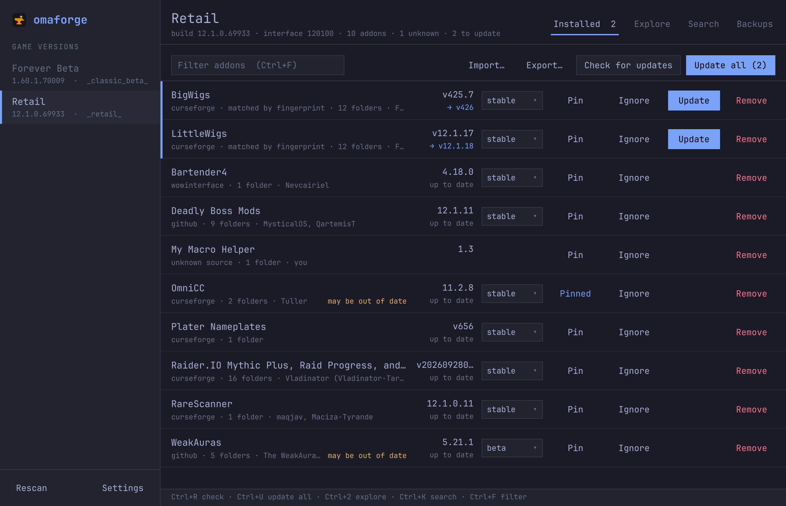
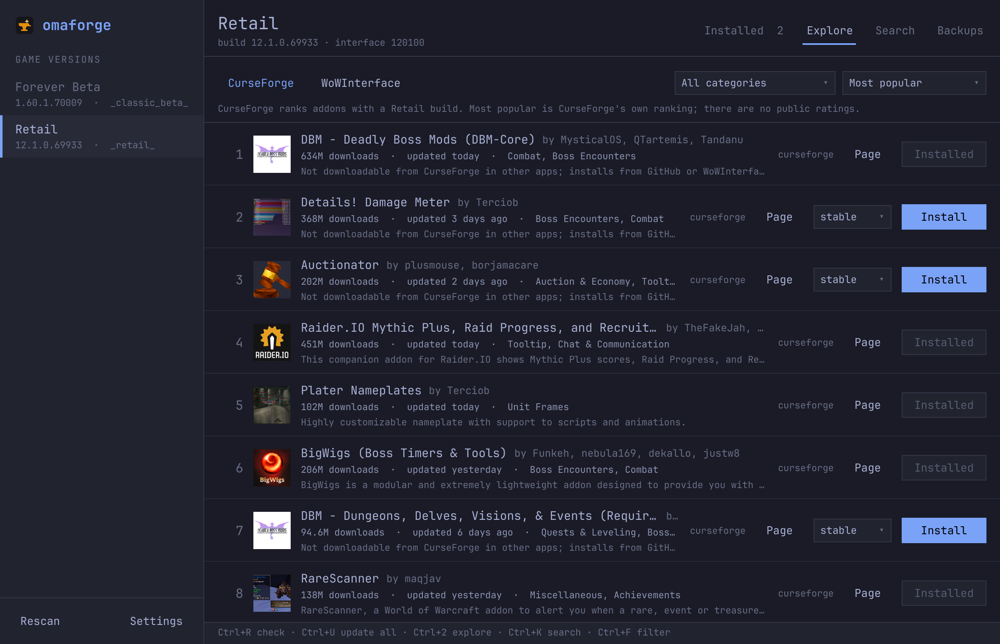
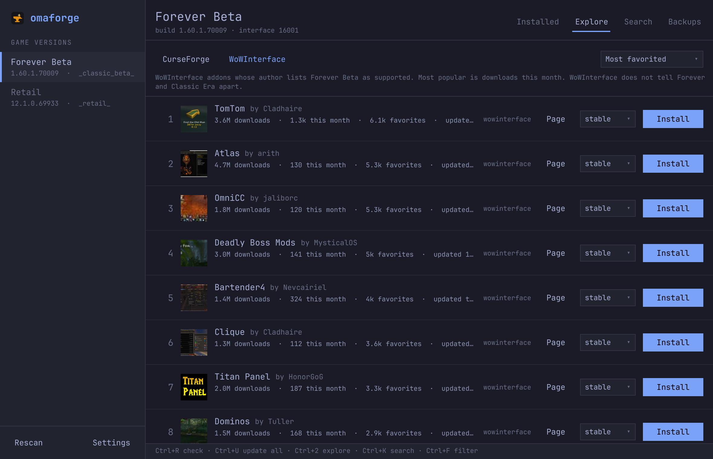
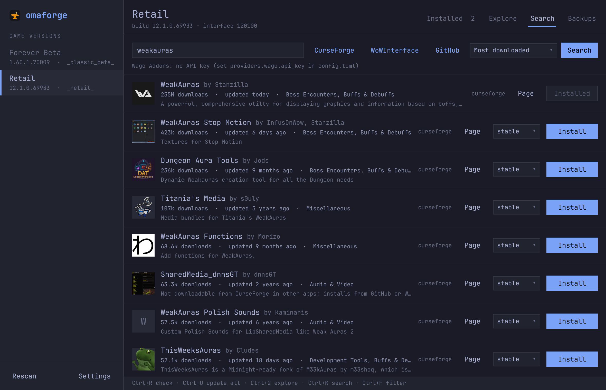
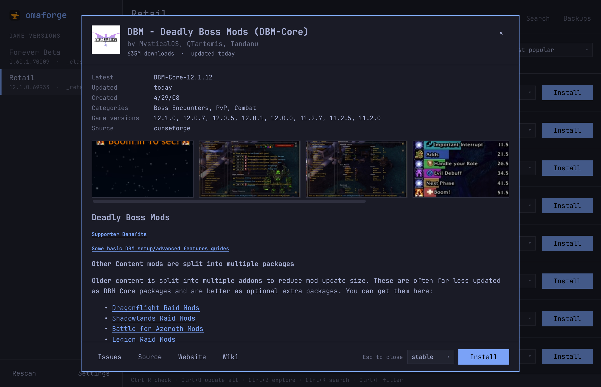
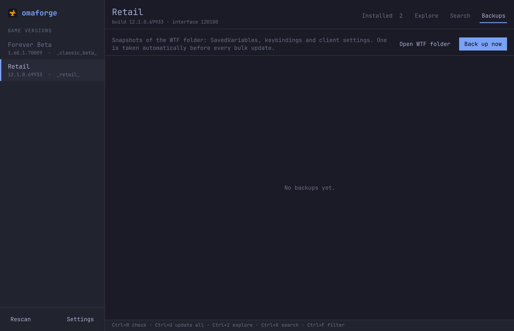
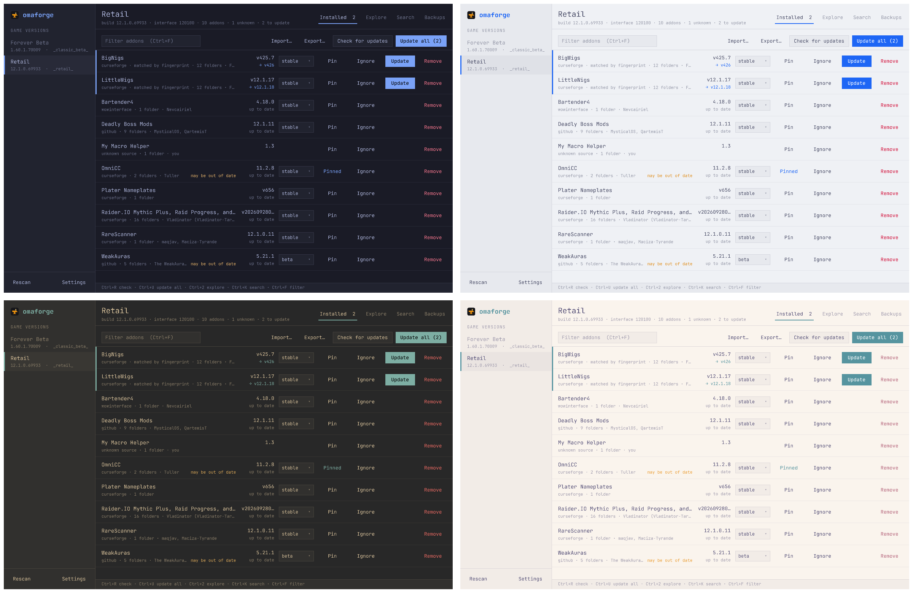

<p align="center">
  
</p>

<h1 align="center">omaforge</h1>

<p align="center">
  A World of Warcraft addon manager for <a href="https://omarchy.org">Omarchy</a>.<br>
  Retail, Classic, Forever and every PTR and beta, running under Wine or Proton.<br>
  <a href="https://omaforge.ninepointlabs.com">omaforge.ninepointlabs.com</a>
</p>

<p align="center">
  <a href="https://github.com/ninepointlabs/omaforge/releases/latest"></a>
  <a href="https://github.com/ninepointlabs/omaforge/actions/workflows/ci.yml"></a>
  <a href="LICENSE"></a>
</p>



omaforge finds every WoW client in your Wine prefixes and shows what each one
has installed, including addons it did not install itself. It installs and
updates addons from CurseForge, WoWInterface and GitHub. It follows your
Omarchy theme and includes a command line for timers and keybindings.

## Contents

- [Features](#features)
- [Install](#install)
- [Using it](#using-it)
- [Command line](#command-line)
- [Addon sources](#addon-sources)
- [Game versions](#game-versions)
- [Files](#files)
- [Development](#development)

## Features

**Every client, found for you.** omaforge scans Lutris, Steam/Proton, Bottles,
Heroic and `~/.wine` prefixes, plus any folder you add, for
`World of Warcraft`. It lists every client folder inside: Retail, PTR, xPTR,
beta, Classic Era, progression Classic, anniversary realms and
**World of Warcraft: Forever**. Each client is a separate entry in the sidebar.

**Knows what you already have.** Copies you installed by hand or with another
manager are recognized:

- CurseForge folder fingerprints identify the exact file you have.
- TOC headers (`X-Curse-Project-ID`, `X-WoWI-ID`, `X-Wago-ID`) link addons to their sources.
- WoWInterface folder lists and GitHub links in the TOC catch the rest.
- Addons spread over many folders (DBM, BigWigs, ElvUI, WeakAuras) show as one
  entry, and uninstalling removes every folder.
- Anything omaforge can't place is listed as *unknown*, never hidden.

**Finds the good stuff.** Explore ranks the top addons for the selected game,
with icons, download counts and categories.



- **CurseForge:** rank by popularity, total downloads or recent updates, and
  filter by category.
- **WoWInterface:** rank by downloads this month, total downloads, favorites or
  recent updates.

Each game version gets its own list, so Forever shows Forever addons:



Neither site publishes star ratings. CurseForge's popularity rank and
WoWInterface's favorites are the closest signals, so those are what omaforge
shows.

**Search across sources** and sort the results by downloads, popularity,
favorites, recent updates or name. Paste a GitHub URL to install straight from
a repository's releases.



**See before you install.** Click any addon for its full description,
screenshots and links from its source. Click a screenshot to see it full
size; <kbd>Esc</kbd> or a click outside closes the window.



**Updates without surprises.**

- **Safe updates:** each download is unpacked next to `AddOns`, then swapped
  in with atomic renames. If anything fails, the previous version is put back.
  Folders a new version no longer ships are removed.
- **Your control:** pin an addon to keep its version, ignore it, or follow its
  stable, beta or alpha channel.
- **Settings are protected:** `WTF` (SavedVariables, keybindings, client
  settings) is backed up before every bulk update, and any backup can be
  restored from the Backups tab.



**Looks like Omarchy.** omaforge uses the active Omarchy theme's colors and
font, and re-themes live when you run `omarchy theme set`. On other desktops it
uses a built-in dark theme.



**Moves with you.** Export a client's addon list to JSON and import it on
another machine or into another client.

## Install

omaforge is built for Omarchy but runs on any Linux desktop. Packages are
attached to every
[release](https://github.com/ninepointlabs/omaforge/releases/latest).

### Omarchy and Arch

```sh
sudo pacman -U omaforge-*-any.pkg.tar.zst
omaforge setup omarchy                                 # "WoW Addons" in the Omarchy menu
omaforge setup omarchy --keybind "SUPER + SHIFT + Z"   # optional keybinding
```

omaforge also appears in the app launcher as **Omaforge**.
`omaforge setup omarchy --remove` removes the menu entry and keybinding. Both
are kept between marker comments in
`~/.config/omarchy/extensions/omarchy-menu.jsonc` and
`~/.config/hypr/bindings.lua`, and a backup is written first.

### Debian, Ubuntu and Fedora

On Debian 13 or newer and Ubuntu 26.04 or newer:

```sh
sudo apt install ./omaforge_*_all.deb
```

On Fedora:

```sh
sudo dnf install ./omaforge-*.noarch.rpm
```

omaforge appears in the app launcher as **Omaforge**. Outside Omarchy it uses
its own dark theme and your system's monospace font.

### Anywhere else

Any distribution with Python 3.11 or newer, including Ubuntu 24.04, can
install omaforge with [pipx](https://pipx.pypa.io). PySide6 then comes from
PyPI:

```sh
pipx install "omaforge[gui] @ git+https://github.com/ninepointlabs/omaforge"
```

A pipx install has no app launcher entry or update timer, and no built-in
CurseForge key (see below).

### CurseForge key and daily updates

Release packages include omaforge's CurseForge API key, so CurseForge works out
of the box. A package built from source (`cd packaging && makepkg -si`, the AUR, or
pipx) doesn't include it. Add your own key under **Settings**, or in
`~/.config/omaforge/config.toml`:

```toml
[providers.curseforge]
api_key = "..."
```

For daily updates with a desktop notification:

```sh
systemctl --user enable --now omaforge-update.timer
```

## Using it

| Key | Action |
|---|---|
| <kbd>Ctrl</kbd>+<kbd>R</kbd> | check for updates |
| <kbd>Ctrl</kbd>+<kbd>U</kbd> | update everything that isn't pinned or ignored |
| <kbd>Ctrl</kbd>+<kbd>1</kbd>…<kbd>4</kbd> | Installed, Explore, Search, Backups |
| <kbd>Ctrl</kbd>+<kbd>K</kbd> | search |
| <kbd>Ctrl</kbd>+<kbd>F</kbd> | filter installed addons |
| <kbd>Ctrl</kbd>+<kbd>,</kbd> | settings |
| <kbd>Ctrl</kbd>+<kbd>Q</kbd> | quit |
| <kbd>Esc</kbd> | close an addon's details or screenshot |

Click an addon anywhere outside its buttons to see its description,
screenshots and links from its source. Click a screenshot to see it full size
and use <kbd>←</kbd> <kbd>→</kbd> to browse. <kbd>Esc</kbd> or a click outside
closes either view.

Hover over an addon's folder count to see its folders, and over a client in
the sidebar to see where it lives.

## Command line

Everything the app does is also available as a command:

```sh
omaforge                          # open the app
omaforge clients                  # detected clients
omaforge list --check -c forever  # installed addons and available updates
omaforge update --all --notify    # update every client; WTF is backed up first
omaforge explore -c forever       # top 25 Forever addons on CurseForge
omaforge explore -p wowi --sort favorites -n 50
omaforge search weakauras --sort downloads
omaforge install curseforge:2382 github:DeadlyBossMods/DeadlyBossMods wowi:11190
omaforge pin|unpin|ignore|unignore <addon>
omaforge channel <addon> beta
omaforge uninstall <addon>
omaforge backup [create|list|restore <id>]
omaforge export retail.json && omaforge import retail.json -c forever
omaforge setup omarchy [--keybind KEYS] [--remove]
```

- Addons can be named by key, folder or title.
- `-c` picks a client by game (`retail`, `forever`), folder (`classic_beta`) or key.
- Every command takes `--json` for scripts and `--offline` to use cached data only.

## Addon sources

| Source | Needs | Notes |
|---|---|---|
| CurseForge | API key (included in release builds) | Search, top lists, install, update, fingerprint matching. See below for addons whose authors disable downloads in other apps. |
| WoWInterface | nothing | Public MMOUI API. One release per addon. |
| GitHub | nothing (token optional) | Releases built with the BigWigs packager; `release.json` picks the right zip for each game. A token raises the rate limit from 60 to 5,000 requests an hour. |
| Wago Addons | API key | Stubbed until access is granted. |

About half of the most popular CurseForge addons have downloads in other apps
turned off by their authors. For those, omaforge looks for the same addon on
GitHub (using the source link on its CurseForge page) or on WoWInterface. If
it finds one, it installs from there and keeps updating from that source.
Otherwise it says so, and **Page** opens the addon on curseforge.com.

omaforge never scrapes websites and never uses another app's API keys.

## Game versions

Clients are identified from their files: `.flavor.info` gives the product
(`wow`, `wow_classic_era`, `wow_classic_beta`, …), and `.build.info` gives its
version. One table, [`omaforge/core/flavors.toml`](omaforge/core/flavors.toml),
maps these to a game, the TOC suffixes that game reads, and the release flavors
to install. To add a branch without a code change, put rules in
`~/.config/omaforge/flavors.toml`; they are tried before the built-in ones.

**World of Warcraft: Forever**

- The beta client is `_classic_beta_`, product `wow_classic_beta`, version
  1.60.x (interface 16001).
- The BigWigs packager builds for it as flavor `forever` (alias `camelot`),
  with `_Camelot` TOC files.
- CurseForge lists it as game version type 88568.
- Whether the client also reads `_Classic` TOCs hasn't been confirmed.
- The live client's product id is unknown, so any client in the 1.60 range is
  treated as Forever. That rule is marked unverified.
- WoWInterface can't tell Forever and Classic Era addons apart, so its Forever
  lists include Classic Era addons.

## Files

| Path | What |
|---|---|
| `~/.config/omaforge/config.toml` | settings and API keys (mode 0600) |
| `~/.config/omaforge/flavors.toml` | optional extra flavor rules |
| `~/.local/share/omaforge/state.json` | what omaforge installed; pins, ignores, channels |
| `~/.local/share/omaforge/backups/` | WTF snapshots per client |
| `~/.cache/omaforge/` | cached API responses |

## Development

```sh
uv venv --system-site-packages --python /usr/bin/python3 .venv
uv pip install --python .venv/bin/python pytest
.venv/bin/python -m pytest -q
.venv/bin/python -m omaforge
```

- **Structure:** the core (`omaforge/core`) has no Qt dependency. The UI
  (`omaforge/ui`) is PySide6 + Qt Quick and talks to the core only through
  `Manager`.
- **Screenshots:** `tools/screenshots.py` regenerates the images in
  `docs/screenshots` from the real UI, offscreen. Point it at a demo install,
  not your own, because paths show up in the UI.

### Releasing

1. Bump `pkgver` in `packaging/PKGBUILD` and `version` in `pyproject.toml` and
   `omaforge/__init__.py`.
2. Push a `v<version>` tag.

The Release workflow then:

- builds the Arch package in an Arch container, with the CurseForge key from
  the `CURSEFORGE_API_KEY` repository secret embedded (obfuscated; see
  `omaforge/buildkey.py`),
- runs the tests,
- builds the `.deb` and `.rpm` from the same wheel with
  [nfpm](https://nfpm.goreleaser.com) (`packaging/nfpm.yaml`),
- installs each package on Arch, Debian 13, Ubuntu 26.04 and Fedora and loads
  the UI from it,
- attaches all three packages to a GitHub release.

The key is never committed.

## License

MIT
